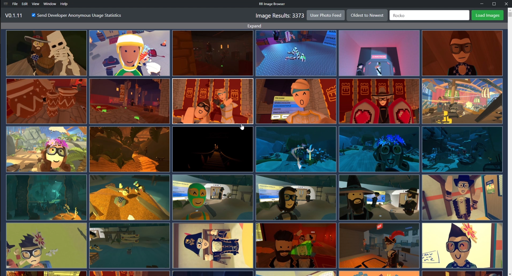
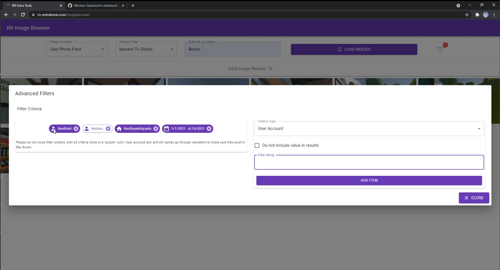

# ⚠️ Notice: This repository is no longer maintained ⚠️

This was **my first React.js project,** created in 2021. It started as a small Electron app (a JavaScript framework for building cross-platform applications) and then evolved into a hosted React tool that served real Rec Room players.

I’m proud of this project because it directly led to me being hired at Rec Room, where I went on to work on [rec.net](https://rec.net) with a small web team, evolving it into the product it is today.

The code here reflects my early development style and doesn’t meet the standards I follow today. Additionally, Rec Room’s APIs and request limits have since changed, making this type of tool difficult to recreate.

> **Thank you to everyone who used this tool while it was live. It was a great learning experience and the project that kickstarted my career.**

---

## Project Background

The app allowed players to browse, filter, and sort their in-game photos — something [rec.net](https://rec.net) at the time did not provide.

**Key features included:**

- Viewing photos by oldest or newest first
- Filtering photos by room, person, date, or date range

It allowed players (especially for users that had been around for 5 years) to quickly find memories with friends in an efficient way.

---

## Screenshots

### First Prototype (Electron)

  

### React Version — Main View

  

### React Version — Filtering View

  

---

-
-
-
-
-
-
-
-
-
-

## Overview

This was created so that I can port over the **RR-Image-Browser** from being built with Electron to instead be a hosted ReactJS app. This allows anyone to access it and there will be no need for software installation.

**Production URL (no longer active):** https://rn-extratools.com/

### Deployment (historical notes)

- `npm run build`
- `netlify deploy` (preview)
- `netlify deploy --prod` (live)

---

## Technology Stack

- [ReactJS](https://reactjs.org/)
- [React Router](https://reactrouter.com/web/guides/quick-start)
- [Material UI](https://material-ui.com/getting-started/installation/)

### Dev Tools

- Visual Studio Code

---

## Planned (but never implemented)

- Database
- Add menu/navigation
- Testing framework

## Ideas for Future Expansion

- User Management
- League Schedule
- League Team Standings
